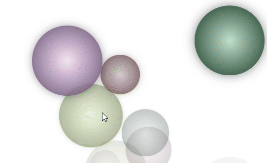
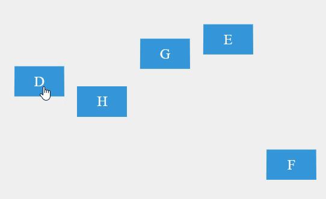
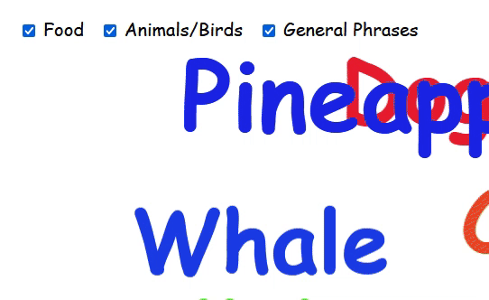

# Simple Interactive Games For Toddlers

Intuitive, interactive Games For Toddlers to play on touch screen.

**You can use the live version [here](https://arun-ks.github.io/ToddlerGames/).**

## Game list
| Name | Game Play | Age level |
|-------|----------|------------|
|[Burst Balloons](https://arun-ks.github.io/ToddlerGames/BurstBaloons.html) | Pop Balls falling from top of the screen | +1.5 years | 
|[Sort Alphabet](https://arun-ks.github.io/ToddlerGames/SortAlphabets.html) | Click on alphabet in correct sequence  | +3 years |
|[Spin Letters](https://arun-ks.github.io/ToddlerGames/SpinLetters.html) | Spin Coin to see a new letter of the alphabet | +2 years |
|[Line Drawing](https://arun-ks.github.io/ToddlerGames/LineDrawing.html) | Use finger to draw lines on screen. If you do not draw for 3 consecutive seconds, the screen will be cleared. | +1.5 years |
|[Word Floater](https://arun-ks.github.io/ToddlerGames/WordFloater.html) | Familiar words floating around in screen | +3 years |
|TBD | Make balls/snowflake? bounce by shaking the screen  | +1.5 years |
|TBD | Keyboard piano, click a key to hear randomly assigned sounds  | +2 years |
|TBD | Hold screen for few seconds  | +4 years |


## Simple Interactive Games For Toddlers

Intuitive, interactive Games For Toddlers to play on touch screen

| Game | Details |
|------|---------|
|  | **Name:** [Burst Balloons](https://arun-ks.github.io/ToddlerGames/BurstBaloons.html)<br>**Game Play:** Pop Balls falling from top of the screen<br>**Age level:** +1.5 years+ |
|  | **Name:** [Sort Alphabet](https://arun-ks.github.io/ToddlerGames/SortAlphabets.html)<br>**Game Play:** Click on alphabet in correct sequence<br>**Age level:** +3 years+ |
|  | **Name:** [Spin Letters](https://arun-ks.github.io/ToddlerGames/SpinLetters.html)<br>**Game Play:** Spin Coin to see a new letter of the alphabet<br>**Age level:** +2 years+ |
|  | **Name:** [Line Drawing](https://arun-ks.github.io/ToddlerGames/LineDrawing.html)<br>**Game Play:** Use finger to draw lines on screen. If you do not draw for 3 consecutive seconds, the screen will be cleared.<br>**Age level:** +1.5 years+ |
|  | **Name:** [Word Floater](https://arun-ks.github.io/ToddlerGames/WordFloater.html)<br>**Game Play:** Familiar words floating around the screen.<br>**Age level:** +3 years+ |
| | **Name:** TBD<br>**Game Play:** Hold screen for few seconds<br>**Age level:** 4 years+ |

## Installation
These use single page HTML files along with some small mp3s taken from [Pixabay](https://pixabay.com/). 

Download all files in this repo & click on index.html to start your journey.


## Co-Development with ChatGPT
Most of the games were created with ChatGPT. The quick prototyping allowed revision & refinement of requirements.

The final code was created after many back-and-forth as the generated code had to be troubleshooted.

Sometimes, I had to suggest corrections & improvements in the code till we got to the final forms. In other cases, ChatGPT helped fix my blunders quickly.

Eventually, one gets to a stage where it is easier to fix the code, than to explain chatGPT its errors.

### Prompt to get Prompt
Once the final code is generated, the following prompt was used to generate prompt for the thread.

> Please give me a full chatGPT prompt which would have generated the last HTML .
> The prompt should be detailed so that if some other use sends the same prompt, an almost identical html file would be generated.

Note that the prompts below were edited manually, to align with the manually updated code.

<details closed>
<summary>ChatGPT prompt to generate Burst Balloons Game  </summary>

```
 Create an HTML webpage with an interactive animation. The animation should involve colorful blobs falling from the top of the screen to the bottom. When a blob reaches the bottom, it should pop or explode with a sound effect. Users should also be able to click or touch a blob to make it pop instantly with a sound effect.
 Here are the specific requirements:
 1. The webpage should have a container element that covers the entire viewport, ensuring no overflow.
 2. Blobs should be created and fall from the top of the screen to the bottom.
 3. Blobs should have a circular shape (border-radius: 50%) and should be of random sizes, with a minimum size of 50px.
 4. Blobs should have random colors. You can use a function to generate random colors.
 5. Blobs should fall at a speed determined by a user-controllable slider. There should be a slider control that allows users to adjust the falling speed of the blobs.
 6. Users should be able to click or touch a blob to make it pop. When a blob is clicked or touched, it should pop with an animation and play a pop sound effect. The pop sound effect should be randomly selected from a list of three sound files: "pop0.mp3," "pop1.mp3," and "pop2.mp3."
 7. The first five blobs should be created within a gap of 0.05 seconds from page load. After that, blobs should be continuously generated at a fixed interval of 0.4 seconds.
 8. The animation for the falling blobs should be smooth and include easing. Blobs should scale slightly as they fall but should maintain their original shape and color throughout the animation.
 9. Ensure that the animation is visually appealing and that the blobs smoothly disappear after popping.
 10. Use appropriate HTML, CSS, and JavaScript to implement this animation. Make sure to include any necessary event listeners and handlers.
 
 Please provide a complete HTML file that includes all the necessary code, styles, and scripts to achieve the described animation. Ensure that the pop sound files are included and properly referenced. If any additional assets or files are required, specify how they should be organized within the project folder.
```

</details>


<details closed>
<summary>ChatGPT prompt to generate Sort Alphabets Game  </summary>

```
Create an HTML5 game suitable for toddlers. The game should be a simple educational game designed to help toddlers learn the alphabet in a fun and interactive way.

Here are the specific requirements for the game:

1. **Game Layout**:
   - The game should be played in a web browser and should utilize HTML5, CSS, and JavaScript.
   - The game should be visually appealing and child-friendly.

2. **Game Start**:
   - When the game starts, it should display 5 colorful 3D boxes on the screen.
   - Each box should contain a random letter of the alphabet. These letters should be chosen consecutively but displayed in a random order within the boxes.
   - The boxes should be positioned randomly within the top 60% of the screen, and they should not overlap.

3. **Gameplay**:
   - The purpose of the game is to teach toddlers the correct order of the alphabet.
   - When a toddler clicks/touches a box with the correct letter in the current alphabetical order, the box should respond as follows:
     - The box should get a yellow halo to indicate correctness.
     - A pleasant sound (e.g., 'correct.mp3') should play to reinforce the correct choice.
     - The selected box should move to the bottom of the screen, next to the previous box selected in the correct order.
   - When a toddler clicks/touches a box with an incorrect letter, the box should respond as follows:
     - The box should shake or wobble to indicate an incorrect choice.
     - A distinct sound (e.g., 'wrong.mp3' or 'oops.mp3') should play to provide feedback.
     - The box should return to its original position.

4. **Game Completion**:
   - The game should end when the toddler successfully selects all 5 boxes in the correct alphabetical order.
   - Upon completion, a congratulatory popup should appear with a message like "Congratulations! You've completed the alphabet."
   - The popup should include an option to restart the game.

5. **Visuals**:
   - The boxes should have a 3D effect to make them visually appealing to toddlers.
   - The background color should be child-friendly.
   - The text inside the boxes should be large and easy to read, suitable for toddlers.
   - The boxes and letters should have bright and attractive colors.
   - The popup should have a child-friendly design.

6. **Audio**:
   - The game should incorporate appropriate audio feedback, including the sounds mentioned above for correct and incorrect choices.
   - Ensure the audio is not too loud or startling for toddlers.

7. **Title**:
   - The title of the game should be "Sort Alphabet Game" to indicate its purpose.

Please generate an HTML5 document that implements this game with the specified features. Ensure the code is well-structured, commented, and easy to understand. Additionally, make sure the game is responsive and suitable for both desktop and mobile devices.

Feel free to use any external resources (such as audio files) to enhance the game. Thank you!
```

</details>


<details closed>
<summary>ChatGPT prompt to generate Spin Letters Game  </summary>

```
Create an HTML5 page for a toddler game with the following features:
- The game should display a circle that covers 90% of the visible window.
- Inside the circle, there should be 1 alphabetic character. This can be randomly chosen as upper case or lower casse 
- The circle should initially appear with the first set of characters.
- When a user taps or clicks on the circle, it should perform a spinning animation for 2 seconds, mimicking the way a coin spins when tossed.
- During the spinning animation, the circle should rotate along the vertical axis.
- After the spinning animation ends, a new random  English letters should replace the previous characters inside the circle.
- The circle should react to user input, so if the user clicks while it's spinning, it should complete the current animation and then perform the spinning again.
- The game should prevent multiple simultaneous spins (no double-clicking during a spin).
- The font size of the characters inside the circle should be large enough to cover approximately 90% of the circle's area.
- The circle and characters should have appropriate color schemes and styles for toddlers (e.g., bright colors, bold letters).
- The game should be simple and user-friendly, designed for toddlers to interact with and enjoy.

Please generate the full HTML code for this toddler game based on the given specifications. Ensure that the spinning animation and character replacement work as described, and provide an example audio file or placeholder for it.
```
</details>


<details closed>
<summary>ChatGPT prompt to generate Line Drawing Game  </summary>

```
Create a simple HTML5 game for toddler using a canvas element that allows users to draw lines & has the following features:
- The play screen should cover the entire screen. When the user drags the mouse or finger over the screen, a thick multicolor line should be drawn.
- When the user releases the mouse or lifts the finger, the line should slowly start to fade, eventually fading out over 3 seconds.
- There is no restriction on the length of the line-drawing, and while the previous line is fading out, the user should be able to create a new line.
- The line should have a double thickness of 20 pixels, and different sections of the line should have different colors instead of the entire line changing color.
- The background color of the page should be light gray (#f0f0f0).

```
</details>

<details closed>
<summary>ChatGPT prompt to generate Word Floater  </summary>

```
I need to create a visualization in which colorful words will fall from the top of the screen or move from left to right (or vice-versa). There should be at most 4-5 words on screen at a time.
When the words reach the other end, they should pop out. This is being made for 3-4 old kids who like to see words.
The intention is to run this on big TV screen. The list of words should be customizable and should be able to handle 100s of words in 2-3 separate lists separated by themes.
```
</details>

##
